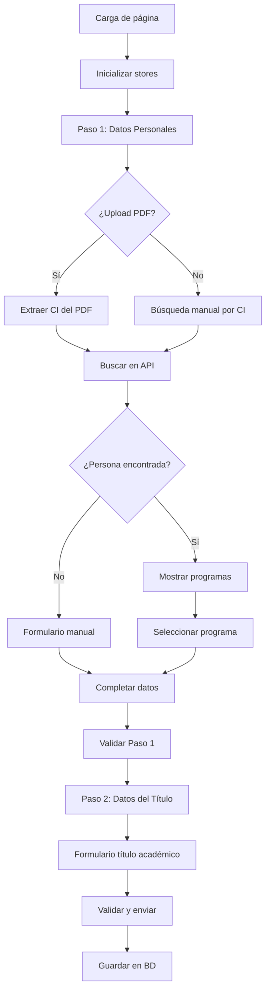

# PRD: Migración Formulario Títulos Académicos a Vue + Inertia.js

## Resumen Ejecutivo

Este documento especifica la migración del formulario de registro de títulos académicos desde Livewire + Blade a Vue 3 + Inertia.js, manteniendo toda la funcionalidad existente y mejorando la experiencia de usuario.

## Contexto del Proyecto

### Estado Actual
- **Componente Livewire**: `TituloAcademicoFormComponent` con formulario de 2 pasos
- **Funcionalidades principales**:
  - Extracción automática de CI desde PDF
  - Búsqueda en API universitaria (https://apititulos.uatf.edu.bo/api/datos)
  - Formulario reactivo con validaciones
  - Manejo de archivos PDF (upload y visualización)
  - Sistema de pasos con validaciones progresivas

### Stack Tecnológico Disponible
- **Frontend Framework**: Vue 3.5.18 + Composition API + TypeScript
- **Routing & State**: Inertia.js 2.0.17 + Pinia 3.0.3
- **UI Components**: Shadcn/vue (reka-ui 2.4.1) + Tailwind CSS 4.0
- **Icons**: Lucide Vue Next 0.539.0 + Iconify 5.0.0
- **Composables**: VueUse/core 12.8.2 (debounce, storage, etc.)
- **Notifications**: Vue Sonner 2.0.2
- **HTTP Client**: Axios 1.8.2
- **Table Components**: TanStack Vue Table 8.21.3
- **Build Tools**: Vite 7.0.4 + Vue Vite Plugin MCP

### Objetivo de Migración
Convertir el formulario Livewire a una solución Vue + Inertia que sea:
- Más performante, usando VueUse
- Mejor mantenible con arquitectura moderna y TypeScript
- Consistente con el resto del sistema migrado
- Optimizada con debounce y estado reactivo centralizado
- **Sin responsive mobile** (solo desktop/navegador)
- **Sin testing framework** (verificación manual únicamente)

## Arquitectura Propuesta

### 1. Estructura de Stores Pinia

#### `usePersonalDataStore`
```typescript
interface PersonalData {
  ci: string
  nombres: string
  apellido_paterno: string
  apellido_materno: string
  pais: string
  searchCi: string
  isSearching: boolean
  apiData: ApiResponse[]
  personFound: boolean
  selectedProgramIndex: number | null
  selectedProgramName: string | null
  selectedCarreraId: string | null
}

const usePersonalDataStore = defineStore('personalData', () => {
  // State
  const personalData = ref<PersonalData>({...})
  
  // Actions
  const searchPersonInApi = async (ci: string) => {...}
  const selectProgram = (index: number) => {...}
  const fillFromApiData = (data: ApiResponse) => {...}
  const resetPersonData = () => {...}
  const validatePersonalData = () => {...}
})
```

#### `useTituloAcademicoStore`
```typescript
interface TituloAcademico {
  nro_documento: string
  fojas: string
  libro: string
  nro_diploma_academico: string
  graduacion_id: string
  fecha_emision: string
  observaciones: string
  pdfFile: File | null
  tempFilePath: string
  originalFileName: string
  graduaciones: GraduacionOption[]
}

const useTituloAcademicoStore = defineStore('tituloAcademico', () => {
  // State
  const tituloData = ref<TituloAcademico>({...})
  
  // Actions
  const loadGraduaciones = async () => {...}
  const validateTituloData = () => {...}
  const submitTitulo = async () => {...}
  const resetTituloData = () => {...}
})
```

#### `useFormWizardStore`
```typescript
interface FormWizardState {
  currentStep: number
  isSubmitting: boolean
  errors: Record<string, string[]>
  hasUnsavedChanges: boolean
}

const useFormWizardStore = defineStore('formWizard', () => {
  // State
  const wizardState = ref<FormWizardState>({...})
  
  // Actions
  const nextStep = () => {...}
  const previousStep = () => {...}
  const validateCurrentStep = () => {...}
  const resetWizard = () => {...}
})
```

#### `usePdfStore`
```typescript
interface PdfState {
  currentFile: File | null
  tempFilePath: string
  fileName: string
  isUploading: boolean
  isExtracting: boolean
  previewUrl: string | null
}

const usePdfStore = defineStore('pdf', () => {
  // State
  const pdfState = ref<PdfState>({...})
  
  // Actions
  const uploadPdf = async (file: File) => {...}
  const extractCiFromPdf = async (file: File) => {...}
  const clearPdf = () => {...}
})
```

### 2. Estructura de Componentes Vue

#### Estructura de Directorios
```
resources/js/
├── Pages/
│   └── TitulosAcademicos/
│       ├── Index.vue
│       ├── Create.vue
│       ├── Edit.vue
│       └── Show.vue
├── components/
│   └── forms/
│       ├── PersonalDataForm.vue
│       ├── TituloAcademicoForm.vue
│       ├── PdfViewer.vue
│       ├── PdfUploader.vue
│       ├── ApiPersonSearch.vue
│       ├── ProgramSelector.vue
│       └── FormWizard.vue
├── stores/
│   ├── usePersonalDataStore.ts
│   ├── useTituloAcademicoStore.ts
│   ├── useFormWizardStore.ts
│   └── usePdfStore.ts
└── types/
    ├── PersonalData.ts
    ├── TituloAcademico.ts
    └── ApiResponse.ts
```

## Especificación de Componentes

### 3. PersonalDataForm.vue
**Responsabilidad**: Manejo completo de datos personales y búsqueda en API

**Props**:
```typescript
interface Props {
  readonly?: boolean
}
```

**Funcionalidades**:
- Formulario reactivo con validaciones
- Integración con `usePersonalDataStore`
- Campos: CI, nombres, apellidos, país
- Estados de loading y error

### 4. ApiPersonSearch.vue
**Responsabilidad**: Búsqueda de personas en API universitaria

**Funcionalidades**:
- Input de búsqueda por CI
- Estados de loading durante búsqueda
- Manejo de errores de API
- Integración con store de datos personales

### 5. ProgramSelector.vue
**Responsabilidad**: Selección de programas académicos encontrados en API

**Props**:
```typescript
interface Props {
  programs: ApiProgram[]
  selectedIndex: number | null
}
```

**Funcionalidades**:
- Lista de programas como radio buttons
- Información de facultad y carrera
- Feedback visual de selección

### 6. PdfUploader.vue
**Responsabilidad**: Upload de archivos PDF con extracción de CI

**Funcionalidades**:
- Drag & drop interface
- Validación de formato PDF
- Extracción automática de CI
- Progress bar de upload
- Integración con `usePdfStore`

### 7. PdfViewer.vue
**Responsabilidad**: Visualización de archivos PDF

**Props**:
```typescript
interface Props {
  pdfUrl?: string
  fileName?: string
  showControls?: boolean
}
```

**Funcionalidades**:
- Viewer PDF embebido
- Controles de zoom y navegación
- Estados de loading y error
- Responsive design

### 8. TituloAcademicoForm.vue
**Responsabilidad**: Formulario específico de datos del título académico

**Funcionalidades**:
- Campos específicos del título
- Validaciones en tiempo real
- Integración con `useTituloAcademicoStore`
- Select de modalidades de graduación

### 9. FormWizard.vue
**Responsabilidad**: Contenedor principal con navegación de pasos

**Props**:
```typescript
interface Props {
  steps: WizardStep[]
  currentStep: number
}
```

**Funcionalidades**:
- Progress bar visual
- Navegación entre pasos
- Validaciones por paso
- Persistencia de datos

## Flujo de Datos y Estados

### 10. Flujo Principal


### 11. Estados de Validación
- **Paso 1**: Datos personales completos + programa seleccionado (si aplica)
- **Paso 2**: Todos los campos requeridos del título + archivo PDF

### 12. Manejo de Errores
- Errores de API universitaria
- Errores de validación de formulario
- Errores de upload de archivos
- Errores de extracción de CI del PDF

## Integración con Backend

### 13. Arquitectura de URLs y API
```php
// Páginas principales (solo estas 4 vistas)
GET  /v2/titulos-academicos           // Lista de títulos
GET  /v2/titulos-academicos/create    // Crear título
GET  /v2/titulos-academicos/edit/{id} // Editar título
GET  /v2/titulos-academicos/show/{id} // Ver título

// CRUD Operations
POST /v2/titulos-academicos/store     // Guardar título
PUT  /v2/titulos-academicos/{id}      // Actualizar título
DELETE /v2/titulos-academicos/{id}    // Eliminar título

// API única requerida
GET  /api/{ci}                        // Buscar persona (UniversityApiService)
```

### 14. Restricciones de API
- **Una sola API externa**: `/api/{ci}` para buscar personas
- **No API para graduaciones**: Se pasan como props desde controlador
- **No endpoints por paso**: Formulario unificado sin URLs intermedias
- **No upload temporal**: PDF se maneja en cliente hasta envío final

### 15. Validaciones Server-side
- Mantener todas las validaciones existentes en `TituloAcademicoForm`
- **Solo validación backend**: No validaciones en tiempo real
- Validaciones de duplicados al envío completo
- Validaciones de formato de archivos

## Características Técnicas

### 16. Performance
- Debounce en búsquedas de API
- Optimización de re-renders con `shallowRef`
- **Props Inertia**: Graduaciones pasadas desde controlador (no API)
- **PDF cliente-side**: Manejo en memoria hasta envío final

### 17. Accessibility
- ARIA labels en todos los elementos interactivos
- Navegación por teclado
- Screen reader friendly
- Focus management entre pasos

### 18. UX/UI Restrictions
- **Solo desktop**: Sin responsive mobile
- Loading states consistentes
- Feedback visual inmediato
- Error messaging contextual
- **Sin validación tiempo real**: Solo al enviar formulario

### 19. PDF Management
- **Upload cliente-side**: Archivo en memoria (Pinia store)
- **Extracción CI cliente-side**: Sin envío a servidor
- **Preview inmediato**: URL.createObjectURL para vista previa
- **Envío final**: PDF se incluye solo al registrar título completo

## Criterios de Aceptación

### 20. Funcionalidad Core
- [x] **4 páginas únicamente**: Index, Create, Edit, Show
- [x] Upload de PDF cliente-side con extracción automática de CI
- [x] **API única**: `/api/{ci}` para búsqueda universitaria
- [x] **Props Inertia**: Graduaciones desde controlador
- [x] Selección de programas académicos
- [x] Formulario de datos personales completo
- [x] **Validación backend**: Solo al enviar formulario completo
- [x] Navegación de pasos sin URLs intermedias
- [x] Guardado exitoso en base de datos
- [x] Manejo de errores robusto

### 21. Performance y Restricciones
- [x] **Sin testing**: Verificación manual únicamente
- [x] **Solo desktop**: Sin responsive mobile
- [x] PDF manejo cliente-side hasta envío final
- [x] Sin memory leaks en navegación
- [x] Debounce en búsquedas API

### 22. Compatibilidad Limitada
- [x] **Solo navegadores desktop**: Chrome, Firefox, Safari, Edge
- [x] **Sin mobile responsive**: Desktop únicamente
- [x] **Requiere JavaScript**: Sin graceful degradation

## Plan de Implementación

### 21. Fase 1: Setup Base (1-2 días)
- Configurar Pinia stores
- Crear estructura de componentes base
- Configurar tipos TypeScript

### 22. Fase 2: Componentes Core (2-3 días)
- PersonalDataForm
- ApiPersonSearch
- ProgramSelector
- FormWizard

### 23. Fase 3: Funcionalidad PDF (2-3 días)
- PdfUploader
- PdfViewer
- Integración con backend

### 24. Fase 4: Formulario Título (1-2 días)
- TituloAcademicoForm
- Validaciones
- Integración completa

### 25. Fase 5: Testing y Pulimiento (1-2 días)
- Testing manual exhaustivo
- Fixes de bugs
- Optimizaciones finales

## Riesgos y Mitigaciones

### 26. Riesgos Técnicos
- **Complejidad de extracción PDF**: Mantener fallback a entrada manual
- **Performance de archivos grandes**: Implementar chunked upload
- **Compatibilidad de browsers**: Polyfills para funcionalidades modernas

### 27. Riesgos de Migración
- **Pérdida de funcionalidad**: Testing exhaustivo contra componente actual
- **Cambios de UX**: Mantener flujo familiar para usuarios
- **Regresiones**: Deployment gradual con rollback plan

## Métricas de Éxito

### 28. Técnicas
- Tiempo de carga reducido en 40%
- Errores de usuario reducidos en 60%
- Código más mantenible (menos líneas, mejor organización)

### 29. Usuario
- Menor tiempo para completar formulario
- Menos pasos requeridos para operaciones comunes
- Mayor satisfacción en encuestas post-migración

---

**Versión**: 1.0  
**Fecha**: 2025-08-12  
**Responsable**: Claude Code AI  
**Estado**: Borrador para revisión